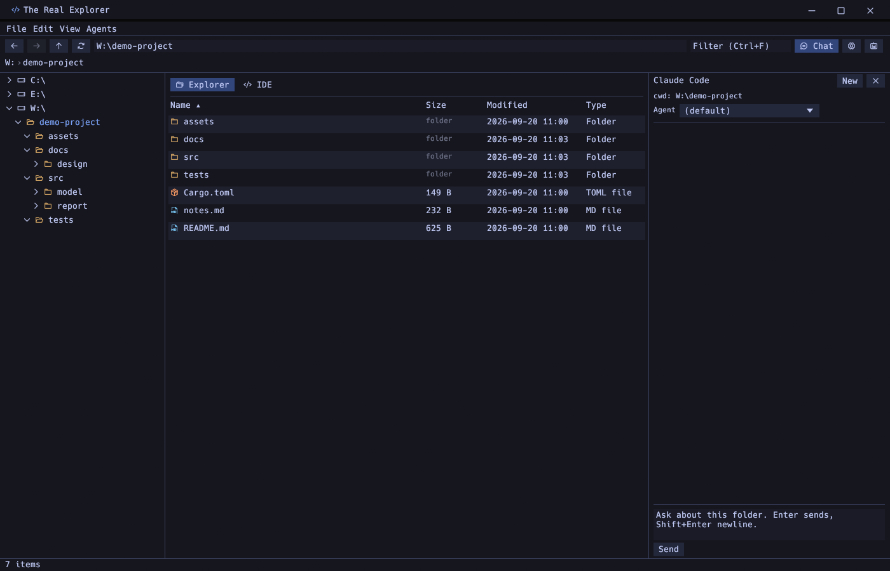
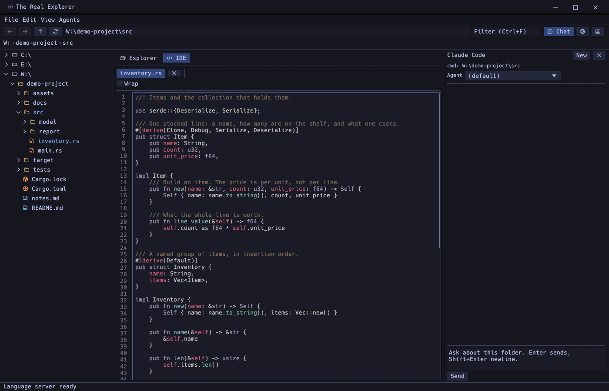
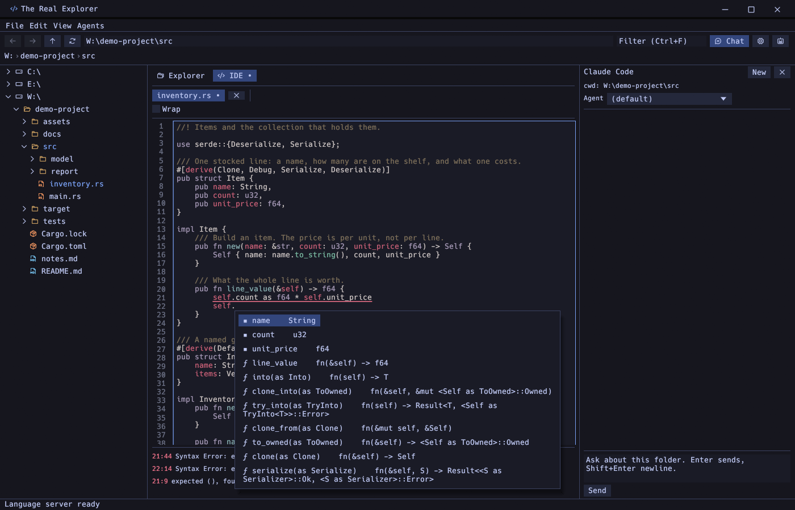
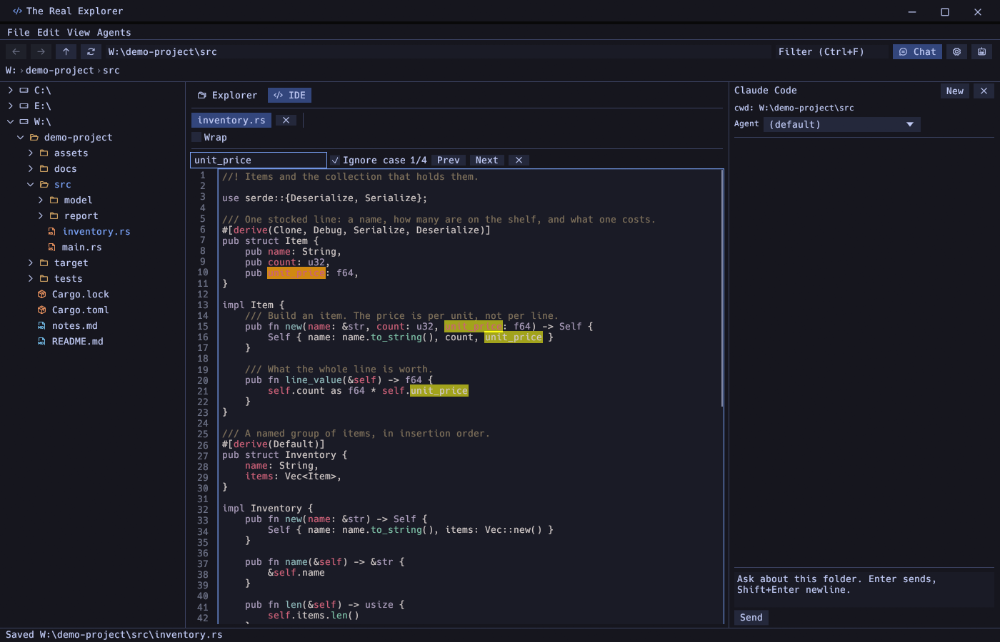
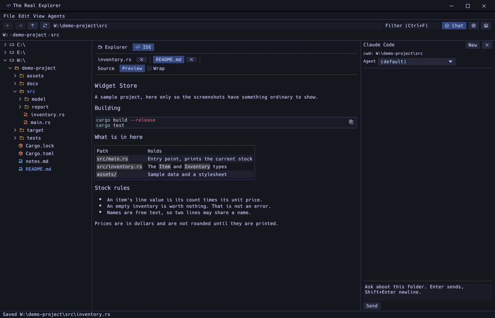
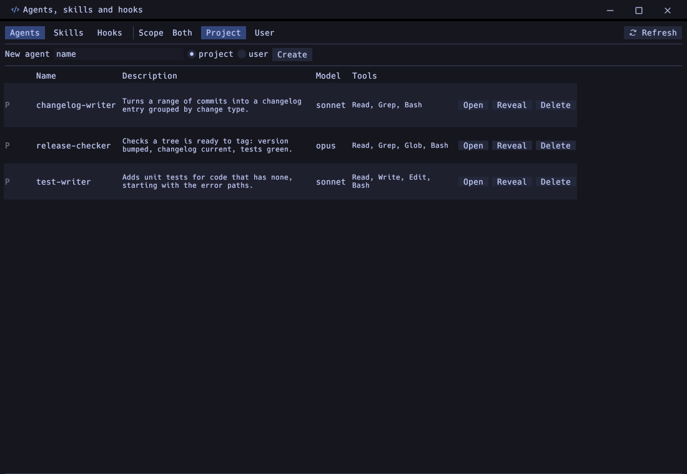
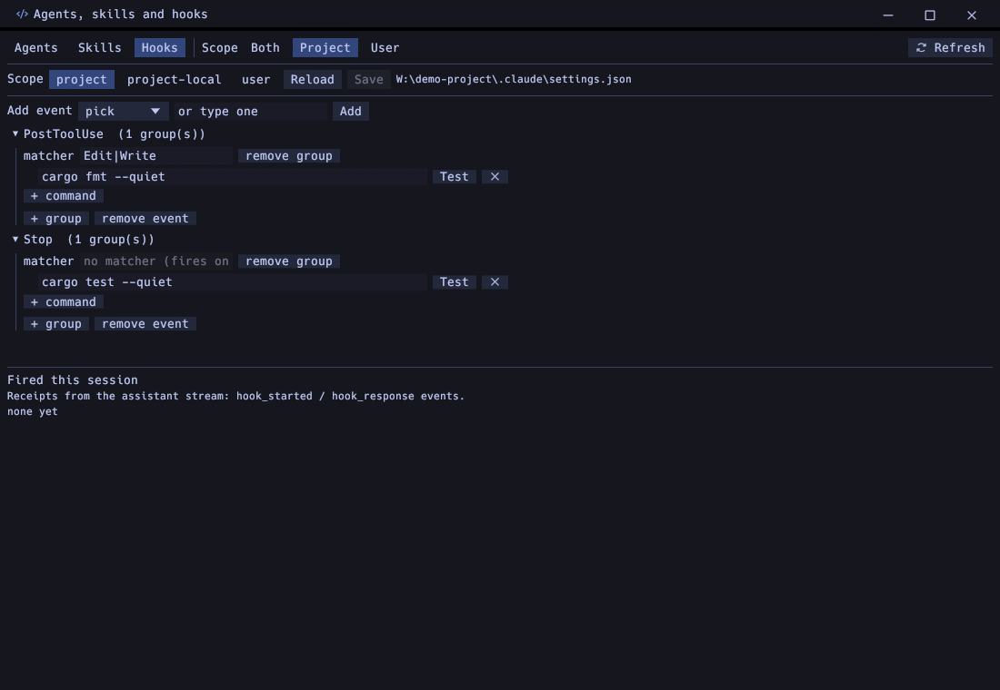
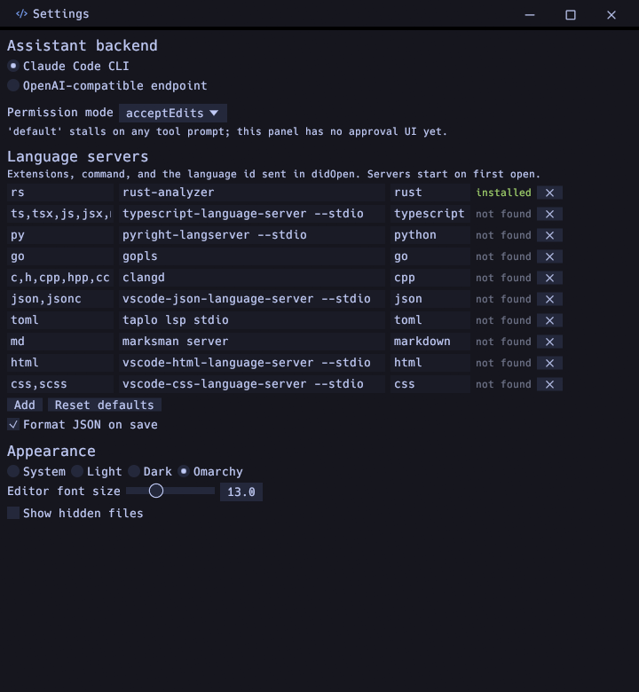

# The Real Explorer

A file explorer, a code editor and an AI assistant in one window. Written in
Rust with [egui](https://github.com/emilk/egui), so it is a single native
binary with no web view.



## What it does

**Explorer.** A folder tree on the left over every drive, a sortable details
list in the middle, and the Windows Explorer operations you expect: copy, cut,
paste, rename, new folder, new file, properties, open a terminal here. Deleting
goes to the recycle bin, and Ctrl+Z brings it back on Windows and Linux;
macOS has no restore API, so there it is a one-way trip to the Trash. Right-click menus mirror the
Windows 11 layout, including View, Sort by and Group by.

**Editor with language servers.** The centre panel switches to an IDE tab with
syntax highlighting, completion, hover documentation and live diagnostics from
any language server on your machine. Completion triggers on `.`, `::`, after
two identifier characters, or Ctrl+Space.



Files over 64 KiB open without syntax colouring and say so in the toolbar.
Colouring costs about a second per 250 KB and reruns on every edit, which made
large files unusable; plain layout of the same text is far cheaper.



Servers are configured per file extension in Settings, with rust-analyzer,
typescript-language-server, pyright, gopls, clangd and others as defaults. One
that is not installed is silent: the editor still works, and Settings marks it
as not found.

Ctrl+F finds in the open file and Ctrl+H replaces, with every match highlighted
and the current one picked out. Ctrl+G jumps to a line.



**Markdown preview**, and HTML opens in your browser. JSON has a formatter on
Ctrl+Shift+F, runs on save, and gets syntax error underlines with no server
installed at all.



**Assistant panel.** Drives the Claude Code CLI in the folder you are looking
at, or any OpenAI-compatible endpoint, which covers Ollama, LM Studio,
OpenRouter and OpenAI. Drag a file or folder from the tree onto the panel to
attach it: Claude Code gets the paths and reads them itself, other backends get
the contents inlined under size caps that announce every cut.

**Agents, skills and hooks**, in their own window. It reads the same files the
Claude Code CLI reads, in both project and user scope, and can create, open,
reveal and delete them.



The Hooks tab edits `settings.json` at project, project-local or user scope
while preserving every other key and its order, writes atomically with a
backup, and refuses to save if the file changed underneath. Test runs a hook
with editable sample input and shows the exact command line, exit code, output
and duration. A live feed below shows hooks actually firing during a turn.



## Running it

```
cargo run --release
```

Or install it: see [packaging/README.md](packaging/README.md) for one command
per platform. Windows produces an NSIS setup that installs for the current user
with no elevation, macOS an app bundle and a dmg, Linux a deb and an AppImage.

## Platform state

|                            | Windows                 | macOS                                | Linux                         |
| -------------------------- | ----------------------- | ------------------------------------ | ----------------------------- |
| Build and tests            | yes                     | yes                                  | yes                           |
| Installer                  | NSIS setup              | app bundle, dmg                      | deb, AppImage                 |
| Window chrome              | drawn by the app        | native title bar, app draws under it | drawn by the app              |
| Delete to trash            | Recycle Bin, restorable | `~/.Trash`                           | freedesktop trash, restorable |
| Drag a file to another app | yes                     | yes                                  | not supported                 |

On macOS, Cmd+Q and the Quit menu item bypass the unsaved-changes guard and
end the process immediately. They call the application terminate path, which
the windowing layer does not intercept, so no event reaches the app. Use the
window's close button, which does prompt. Fixing this needs an application
delegate at the AppKit level rather than a change in this code.

Windows is the development platform. macOS was tested on an Apple silicon Mac
mini and Linux on Ubuntu 24.04, both including the installers.

Dragging out to another application is unavailable on Linux because the crate
behind it needs a GTK application window that eframe cannot supply; the app
says so rather than pulling GTK into the build.



## Configuration

Global settings live in the platform config directory, for example
`%APPDATA%\the-real-explorer\config.json`. A project can override the theme,
editor font size, JSON formatting and hidden files in `.code/settings.json`,
which is applied when you open that folder. File has an item that writes the
current settings there.

An API key for an OpenAI-compatible endpoint is stored in that config file in
plain text.

## Themes

System, light, dark, and Omarchy, which is the Tokyo Night palette in
monospace with flat edges. The screenshots above are Omarchy, taken against a
small sample project rather than a real one.

## Building

Rust stable and a C compiler. On Linux that is `build-essential` and nothing
else: no X11, Wayland, GL or GTK development packages.

```
cargo build --release
cargo test
```

The test suite covers the attachment size caps, the trash operations including
a restore round trip, the hooks round trip and the hook runner, the agent and
skill discovery, the JSON diagnostics, and a live rust-analyzer session.
